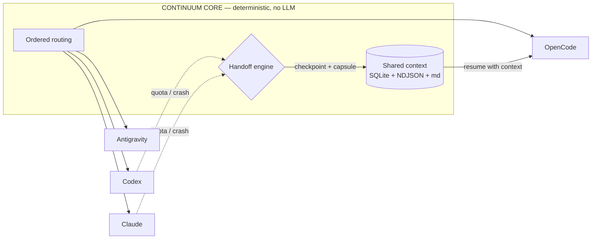

<p align="center">
  
</p>

<h1 align="center">Continuum</h1>

<p align="center">
  <strong>The agent can stop. The project context doesn't.</strong>
</p>

<p align="center">
  <a href="https://github.com/EmadEdu2033/Continuum/actions/workflows/ci.yml"></a>
  <a href="LICENSE"></a>
  
  
  
</p>

<p align="center">
  A local, <strong>provider-neutral continuity runtime</strong> for AI coding agents.<br />
  Continuum orchestrates <strong>Codex CLI, Claude Code, OpenCode</strong> and <strong>Antigravity CLI</strong>
  over one shared project context — so when the active agent hits a usage limit or dies,
  the task <strong>checkpoints, hands off, and continues</strong> with the next agent instead of restarting from scratch.
</p>

---

## ✨ Why Continuum?

| Pain | Continuum answer |
|---|---|
| Agent hits a 5-hour / weekly limit mid-task | `QUOTA_EXHAUSTED` → checkpoint → compact handoff capsule → next provider continues |
| Each CLI lives in its own context window | Virtual shared context: repo state + durable memory + working state + handoff capsule |
| Parallel agents overwrite each other | Single-writer `workspace.lock` — one active writer, clean handoffs |
| "What was the plan again?" after switching tools | `.continuum/` memory: decisions, constraints, sessions, event log, checkpoints |

## 🚀 Quickstart

```bash
# 1. Install (from this repo)
npm install && npm run build && npm link

# 2. Inside any project you want to protect
cd my-project
continuum init          # creates .continuum/ (config, memory, state dirs)
continuum doctor        # which real CLIs are installed & authenticated

# 3. Guided run — pick the starter, failover is automatic
continuum start         # interactive: choose codex/claude/opencode/antigravity
# or one-shot:
continuum run "Build the authentication system and run all tests"

# 4. Watch state
continuum status        # task + provider states + event count
continuum handoff       # latest handoff capsule
continuum logs          # normalized event log
continuum switch claude # start next run with claude
continuum resume        # resume a paused task
```

> Offline demo? Add `--mock` to `run` / `start` / `doctor` to use scripted mock providers.

## 🧠 How it works



1. **You pick a starter** (`continuum start`); the rest stay on standby — zero tokens spent until needed.
2. **The active agent works**; every output is normalized into one event protocol (`SessionStarted`, `FileChanged`, `CommandExecuted`, `AgentError`, …).
3. **On failure** the supervisor classifies the error, freezes the writer, snapshots `git status/diff`, writes a checkpoint and a compact **handoff capsule** (built from stored state — works even if the agent died mid-sentence).
4. **The next provider resumes**: it reuses its native session when available, inspects the repo first, and continues the same task.

## 🔌 Providers

| Provider | Binary | Session resume |
|---|---|---|
| Codex | `codex exec --json` | `resume <id>` |
| Claude Code | `claude -p --output-format stream-json` | `--resume` |
| OpenCode | `opencode run --format json` | `-s <id>` |
| Antigravity | `agy -p --output-format stream-json` | `--conversation` |

Uninstalled providers are skipped automatically (preflight `detect()`), never failing the run. Per-provider model overrides live in `.continuum/config.yaml`.

## 🔁 Failover policy

| Normalized error | Behavior |
|---|---|
| `QUOTA_EXHAUSTED` / `PROVIDER_UNAVAILABLE` | checkpoint → handoff capsule → next provider |
| `TEMP_RATE_LIMIT` / `NETWORK_FAILURE` | retry with backoff (configurable), then next provider |
| `AUTH_REQUIRED` / `USER_CANCELLED` | pause task (`continuum resume` later) |
| `CONTEXT_EXHAUSTED` | mark provider, pause (compaction on roadmap) |
| `AGENT_CRASH` | pause, recover from latest checkpoint |

## 📁 `.continuum/` layout

```text
.continuum/
  config.yaml          routing order, failover rules, provider options
  state.db             SQLite: tasks, providers, checkpoints
  events.ndjson        append-only normalized event log
  project.md  decisions.md  constraints.md   durable human-readable memory
  current-task.json    quick-look task state
  handoffs/            capsules (+ latest.txt)
  checkpoints/         git status/diff snapshots
  sessions/            native session ids for resume
  workspace.lock       one active writer at a time
```

## 🗺 Roadmap

- [x] Deterministic supervisor, ordered routing, writer lock
- [x] Checkpoints + system-generated handoff capsules
- [x] Codex / Claude / OpenCode / Antigravity adapters
- [x] Retry with backoff, preflight skip, mock mode
- [ ] Hierarchical context compactor
- [ ] Smart routing (beyond fixed order)
- [ ] Full-screen TUI
- [ ] Optional semantic memory index

## 🤝 Contributing

PRs welcome! Run the checks before pushing:

```bash
npm run build && npm test   # 14 tests, must stay green
```

Keep adapters isolated (no provider logic in core) and add a regression test with every failover fix.

## 📄 License

[MIT](LICENSE) — free for personal and commercial use.
